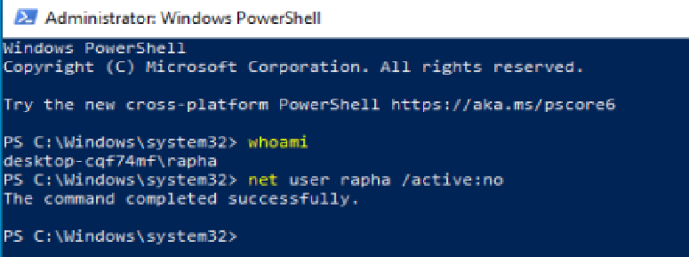

On crée un nouvel utilisateur 'User667' 


on aurait aussi pu faire ainsi 
```PowerShell 
New-ADUser -Name "OsiJack" `
           -DisplayName "osijack" `
           -GivenName "osijack" `
           -Surname "osijack" `
           -SamAccountName "osijack" `
           -UserPrincipalName "osijack@yboost.local" `
           -EmailAddress "osijack@yboost.local" `
           -Path "OU=Personnel,DC=IT-CONNECT,DC=LOCAL" `
           -AccountPassword(Read-Host -AsSecureString "BlackTsar667") `
           -Enabled $true
```

sur le client on ajoute le domaine comme DNS


et on se met dans le bon domaine


je retire l'utilisateur de base


sur le server je crée une GPO 'yboostGPO'


Dans le Group Policy Management Editor je cherche le paramètre correspondant a la protection en temps réel (trouvé dans Computer Configuration > Policies > Administrative Templates > Windows Components > Windows Security > Virus and threat protection) j'active ensuite 'Hyde Virus and threat protection Area'


je force la Màj 


ET C'EST BON


**Je comptais faire les autres parties du TP mais je ne pense pas pouvoir les dinir d'ici Dimanche**